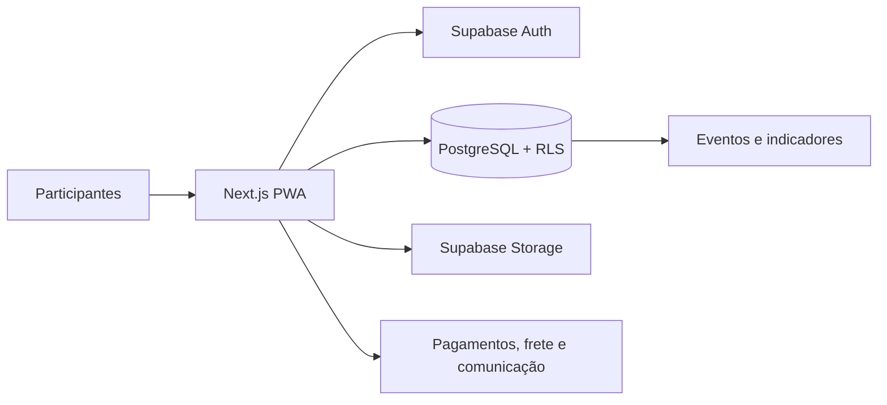

# Conexão Circular

Plataforma digital para economia circular que conecta consumidores, produtores,
cooperativas e parceiros locais em jornadas de coleta, consumo consciente,
benefícios e acompanhamento de impacto.

> Este repositório é uma vitrine técnica pública e uma referência de produto.
> Não contém dados de produção, credenciais ou configuração para acesso ao
> ambiente operacional. A presença de uma funcionalidade no código não significa
> que ela esteja homologada para operação pública ou financeira.

## O que o projeto resolve

Iniciativas de economia circular costumam operar por canais fragmentados. A
Conexão Circular organiza, em uma experiência única:

- solicitação e acompanhamento de coletas;
- marketplace de produtos e parceiros circulares;
- pontos, cashback e benefícios;
- formação do Agente Circular;
- curadoria e indicadores de impacto.

## Para quem é

| Perfil | Jornada principal |
| --- | --- |
| Consumidor | Solicitar coleta, comprar, acompanhar pedidos e acessar benefícios |
| Produtor | Publicar produtos, administrar estoque, pedidos e envios |
| Cooperativa | Receber solicitações, confirmar atendimento e registrar evidências |
| Parceiro | Oferecer benefícios e participar da rede circular |
| Administração | Aprovar cadastros, curar a rede e acompanhar a operação |

## Estágio atual

O produto está em consolidação para piloto controlado. Cadastro, perfis,
coletas, catálogo, loja, PWA, pontos e formação possuem implementação parcial
ou funcional. Pagamentos, logística, conciliação, operação em campo e
indicadores ainda exigem homologação específica.

Consulte o [estágio detalhado e o roadmap](docs/roadmap.md) para distinguir o
que está implementado, parcial, planejado ou bloqueado.

## Arquitetura resumida



Mais detalhes estão em [`docs/architecture.md`](docs/architecture.md).

## Stack

- Next.js 16, App Router e Server Actions;
- React 19 e TypeScript strict;
- Supabase para PostgreSQL, Auth e Storage;
- Tailwind CSS v4 e componentes Radix/shadcn;
- PWA com manifest, service worker, fallback offline e Web Push;
- Vitest, testes Node, ESLint e TypeScript.

## Rodando localmente

Pré-requisitos: Node.js compatível, npm e um projeto Supabase de
desenvolvimento. O código não deve ser conectado a um banco de produção.

```bash
npm ci
cp .env.example .env.local
npm run dev
```

Para verificar a instalação:

```bash
npm run lint
npm run test
npm run build
```

As migrações em `supabase/migrations/` descrevem o schema e as políticas do
produto. Aplique-as somente em um ambiente de desenvolvimento ou staging que
você controla, depois de revisar cada migration.

## Variáveis de ambiente

`.env.example` contém apenas nomes, placeholders e valores de desenvolvimento.
Nunca adicione `.env`, tokens, chaves privadas ou credenciais a commits.

Segredos de Supabase, pagamentos, frete, e-mail e Web Push são exclusivamente
de servidor. O repositório público não deve ser usado como fonte de segredos ou
como configuração de produção.

Leia também [`docs/demo.md`](docs/demo.md) e
[`docs/security-and-privacy.md`](docs/security-and-privacy.md).

## Estrutura

```text
src/                    Aplicação, rotas, APIs e componentes
supabase/migrations/    Schema, funções, triggers e RLS versionados
public/                 PWA, abertura, ícones e assets públicos
tests/                  Testes de comportamento e contratos
docs/                   Documentação pública do produto e da arquitetura
.github/                CI, templates e regras de colaboração
```

## Escopo público

Este repositório deliberadamente não contém:

- dados de usuários, empresas, cooperativas ou participantes;
- manifests de importação, relatórios ou backups;
- credenciais, tokens ou chaves privadas;
- configurações de produção e deploy;
- ferramentas internas de importação e operação;
- arquivos de instrução internos de agentes.

Se encontrar um possível segredo ou dado pessoal, não abra uma issue pública:
consulte [`SECURITY.md`](SECURITY.md).

## Contribuição

Leia [`CONTRIBUTING.md`](CONTRIBUTING.md) antes de abrir uma Pull Request. Toda
contribuição deve passar pelos testes e pela revisão de segurança apropriada.

## Licença

Uma licença de reutilização ainda não foi definida. Até que isso seja decidido,
a publicação permite inspeção do projeto, mas não concede automaticamente uma
licença para redistribuição ou uso comercial.

---

Última revisão do snapshot público: 30 de setembro de 2026.
