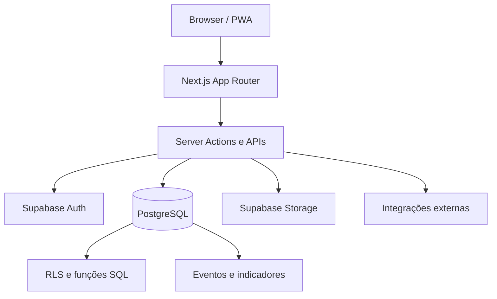

# Arquitetura pública

## Visão geral

## Camadas

- `src/app/`: páginas, layouts, Server Actions e endpoints;
- `src/components/`: componentes reutilizáveis da interface;
- `src/lib/`: regras de domínio, clientes de integração e utilitários;
- `supabase/migrations/`: schema, funções, triggers, buckets e políticas RLS;
- `public/`: abertura pública, service worker e assets;
- `tests/` e `src/lib/*.test.ts`: contratos e testes de regras.

## Segurança por desenho

- autenticação e sessão passam pelo Supabase Auth;
- autorização é validada no servidor e nas políticas RLS;
- chaves administrativas não são usadas no cliente;
- evidências e documentos devem permanecer em buckets privados;
- webhooks precisam validar autenticidade e idempotência;
- dados públicos do mapa são uma projeção explícita, não uma leitura livre de
  perfis internos.

## Integrações

Pagamentos, frete, e-mail, notificações e geocodificação são adaptadores
substituíveis. O desenvolvimento deve usar sandbox, mocks ou ambiente de teste;
o repositório público não fornece credenciais nem acesso a contas reais.
